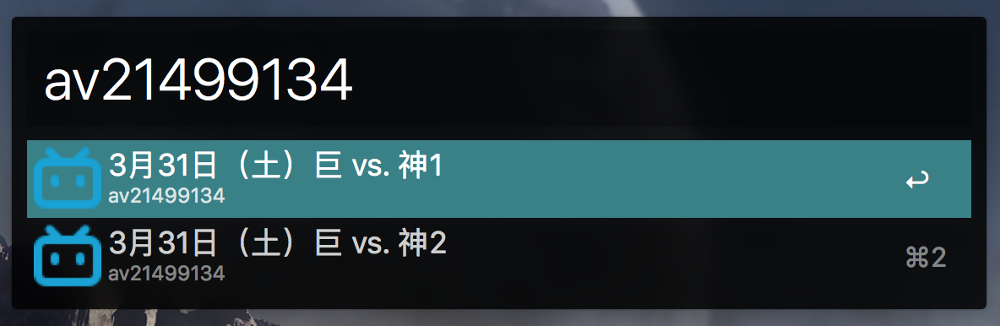

# alfred-video-detector
[](https://travis-ci.org/rudeigerc/alfred-video-detector)
[](https://github.com/rudeigerc/alfred-video-detector)
[](https://opensource.org/licenses/MIT)

Inspired by [acg-video-detector](https://github.com/dyweb/acg-video-detector).

## Installation

```
$ cd ~/Documents/Alfred.alfredpreferences/workflows/
$ git clone https://github.com/rudeigerc/alfred-video-detector.git
$ cd alfred-video-detector
$ npm install
```
## Screenshot


*Requires [Node.js](https://nodejs.org) 4+ and the Alfred [Powerpack](https://www.alfredapp.com/powerpack/).*

## License

MIT
